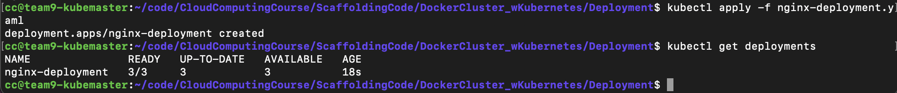
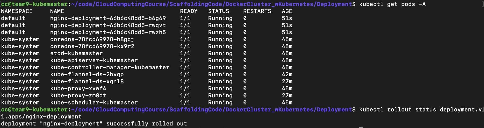
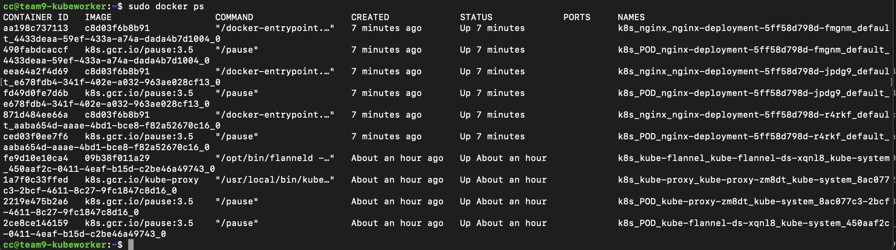
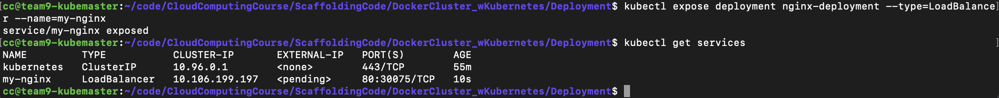
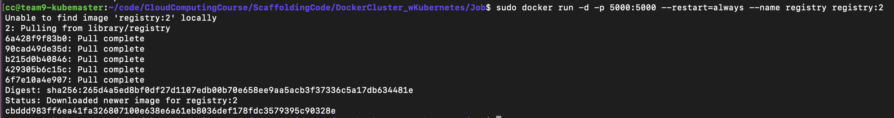
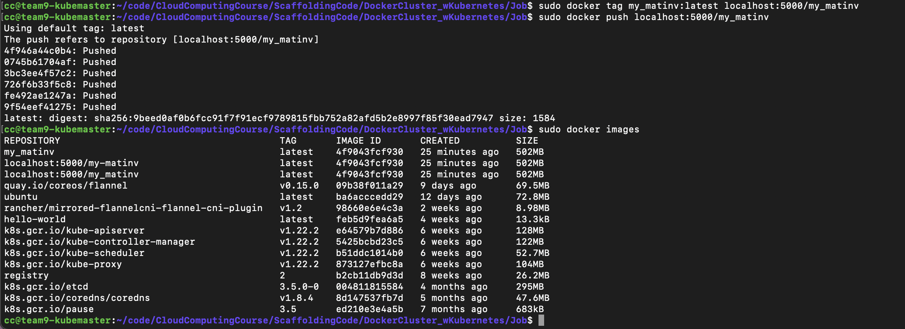
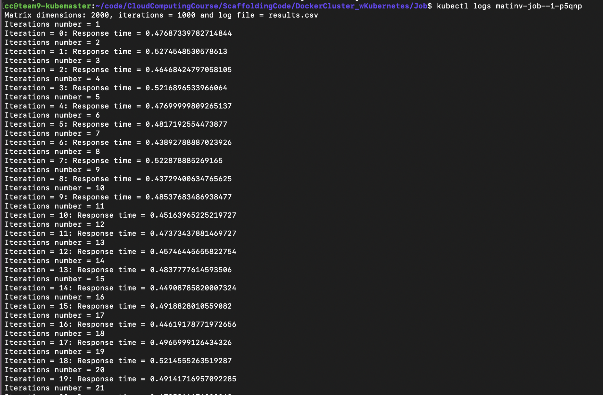
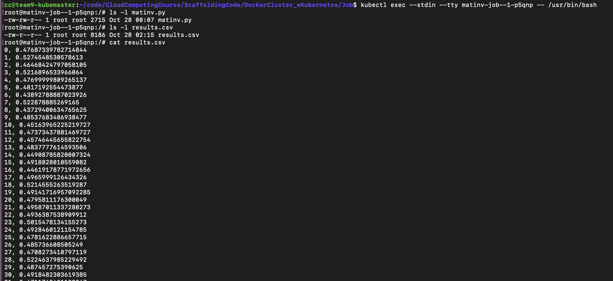
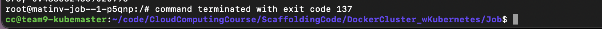

# Assignment 3 - CS5287

## Grading 
The video shows the correctness. 
teamwork was an even split 50:50. 
We spent hours and hours on making this system work and the effort expended on our part was enormous.  
see video link for final item. 

### Instructions 
You can run this code by downloading the clouds.yaml from CC and placing it in the `Ansible_Kubernetes/` directory.  
After this, you must install ansible on your local machine along with the openshift ansible galaxy package.  
Then run `ansible-playbook --inventory MyInventory playbook_create_and_provision.yml` and wait for 20 minutes.  
Verificaiton commands include running `python3 producer.py ny` or `python3 producer.py chi` then logging into the database and checking if the document count has increased. 

## Milestone 3

### Checklist 

* Once again tear down the K8scluster from milestone #2 (don’t terminate the VMs)
  * Done.
* Write additional playbooks that can not only create the cluster via playbooks but also the automated deployment
  * Done. 
* Run your master playbook such that it starts from the K8scluster deployment step.
  * Done. 
* Show that the pipeline is running inside the K8s managed cluster via the ansible automation (milestone 3 only; no need to recreate all the VMs and no need to reinstall all the packages)
  *  Done. 

### Demo 
Video link: [https://youtu.be/LUQjRidzu3w](https://youtu.be/LUQjRidzu3w)  

## Milestone 2

### Checklist 
* After taking the video of milestone 1 and showing to TA, teardown the manually created k8s cluster and the steps you did manually in milestone 1.
  *  Done.
* Extend your Ansible playbooks that can create the k8s cluster, worker addition and master tainting via playbook.
  * Done.
* Develop the appropriate docker files and k8s YAML files for ZooKeeper, Kafka Broker, CouchDB and Consumermanually (no need to automatically create these).
  * Done.
* By logging into the master, manually show that you can deploy all the parts of our ecosystem and show everything runs like it did in Assignment #2
  * Done.

### Demo 
Video link: [https://youtu.be/LUQjRidzu3w](https://youtu.be/LUQjRidzu3w)
see above for `"README file explaining how to run the code"`

## Milestone 1
Video link: [https://youtu.be/LUQjRidzu3w](https://youtu.be/LUQjRidzu3w)
see above for `"README file explaining how to run the code"`

* You will need to tear down at least one of the VMs prior to this assignment because we will need the master to be a m1.medium machine. 
   * Done.

* Reuse and extend the playbooks to install all the necessary underlying packages you need to get Kubernetes work.
   * Done. Playbook can be found [here](https://github.com/parishwolfe/5287-A2/blob/main/Ansible_Kubernetes/tasks/install_kubernetes.yaml) and [here](https://github.com/parishwolfe/5287-A2/blob/main/Ansible_Kubernetes/playbook_create_and_provision.yml).
* Now do this manually for milestone 1: 
    * Log into VM2 (master) and run the kubeadm command on master to create a cluster
        * Done. 
    * Add VM3 as a worker to this master
        * Done. Screenshot below 
    * Taint the master so that the master can also become a worker
        * Done. 
    * Run the scaffolding code (Deployment and Job demos) to show that you can deploy a deployment pod and worker pod on your k8s cluster
        * Done. Screenshots below. 
    
   ###  Running Scaffolding Code 
   
   Starting nginx-deployment.
   
   
   
   
   Taking a closer look at the deployment. 
   
   
   Here we can see the docker containers all running of Kubeworker2 .
   
   
   Here we expose the deployment, and take a look at the services running. 
   
   
   
   Setting up a private registry on Master
   
   
   And here it is running as a container 
   
   
   I tag the push the image to the local repository. 
   
  
    I then start the new job
   
   
   After restarting the registry, and starting the pod, I check the logs 
   
   
   I then log into the pod, and you can see the job complete. 
   
   
   
