# Assignment 3 - CS5287

## Milestone 3
Video link: [https://youtu.be/LUQjRidzu3w](https://youtu.be/LUQjRidzu3w)  
You can run this code by downloading the clouds.yaml from CC and placing it in the `Ansible_Kubernetes/` directory.  
After this, you must install ansible on your local machine along with the openshift ansible galaxy package.  
Then run `ansible-playbook --inventory MyInventory playbook_create_and_provision.yml` and wait for 20 minutes.  
Verificaiton commands include running `python3 producer.py ny` or `python3 producer.py chi` then logging into the database and checking if the document count has increased. 
The video shows the correctness  
teamwork was an even split 50:50  
We spent hours and hours on making this system work and the effort expended on our part was enormous.  
see video link for final item. 

## Milestone 2
Video link: [https://youtu.be/LUQjRidzu3w](https://youtu.be/LUQjRidzu3w)
see above for `"README file explaining how to run the code"`

## Milestone 1
Video link: [https://youtu.be/LUQjRidzu3w](https://youtu.be/LUQjRidzu3w)
see above for `"README file explaining how to run the code"`

* You will need to tear down at least one of the VMs prior to this assignment because we will need the master to be a m1.medium machine. 
   * Done.

* Reuse and extend the playbooks to install all the necessary underlying packages you need to get Kubernetes work.
   * Done. Playbook can be found [here](https://github.com/parishwolfe/5287-A2/blob/main/Ansible_Kubernetes/tasks/install_kubernetes.yaml) and [here](https://github.com/parishwolfe/5287-A2/blob/main/Ansible_Kubernetes/playbook_create_and_provision.yml).
* Now do this manually for milestone 1: 
    * Log into VM2 (master) and run the kubeadm command on master to create a cluster
        * Done. 
    * Add VM3 as a worker to this master
        * Done. Screenshot below 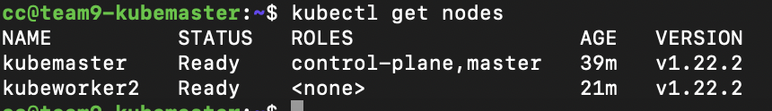
    * Taint the master so that the master can also become a worker
        * Done. 
    * Run the scaffolding code (Deployment and Job demos) to show that you can deploy a deployment pod and worker pod on your k8s cluster
        * Done. Screenshots below. 
    
   ###  Running Scaffolding Code 
   
   Starting nginx-deployment.
   
   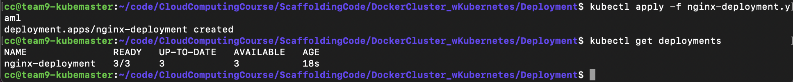
   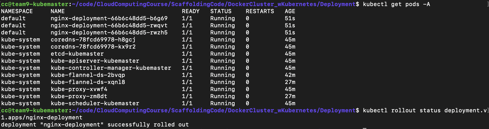
   
   Taking a closer look at the deployment. 
   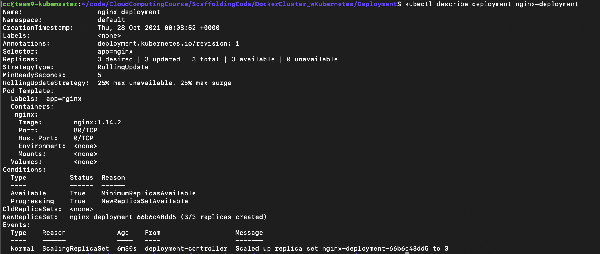
   
   Here we can see the docker containers all running of Kubeworker2 .
   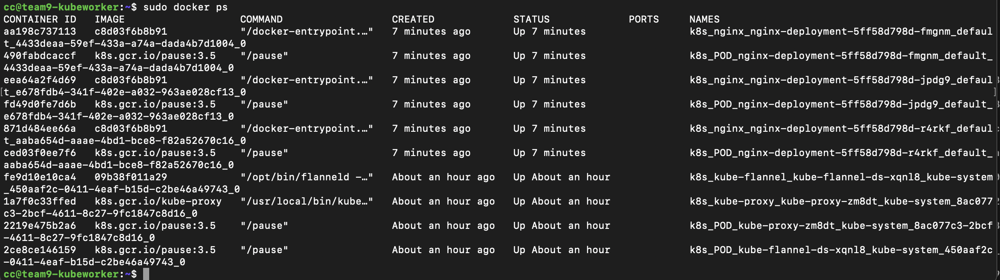
   
   Here we expose the deployment, and take a look at the services running. 
   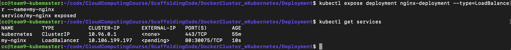
   
   
   Setting up a private registry on Master
   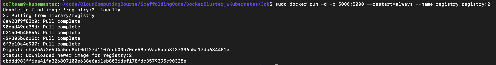
   
   And here it is running as a container 
   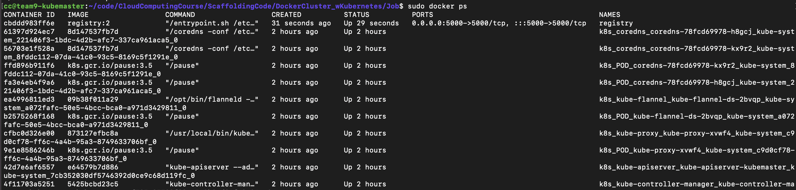
   
   I tag the push the image to the local repository. 
   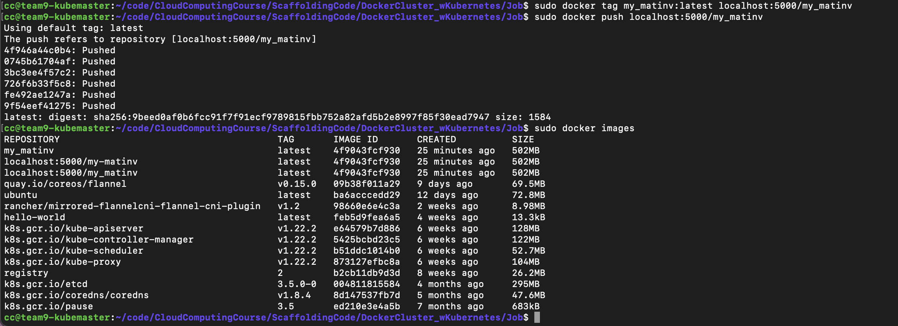
  
    I then start the new job
   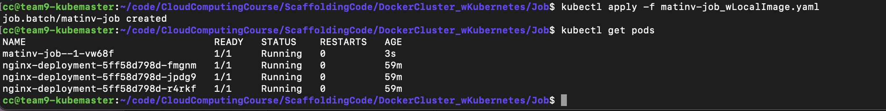
   
   After restarting the registry, and starting the pod, I check the logs 
   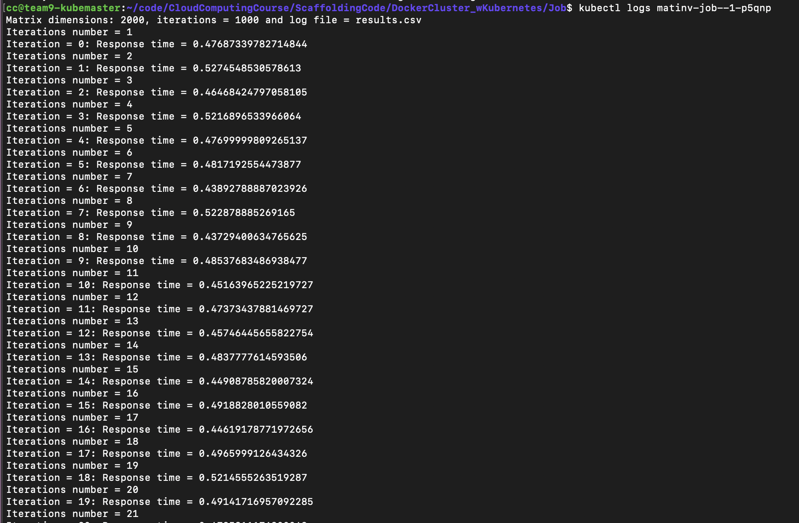
   
   I then log into the pod, and you can see the job complete. 
   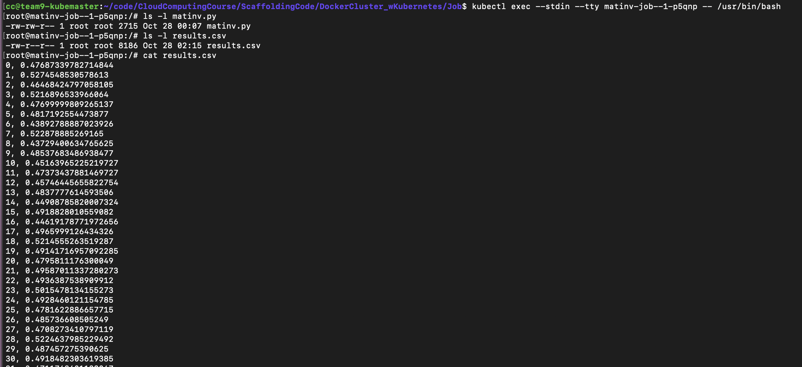
   
   
   ## Distribution of work
   We both first manually went through the steps to download docker and create a kubernetes cluster. This took some time to get correct. Afterwards, parish created the playbook for installing and configuring kubernetes. Alex then created the documentation, after we both went through the Scaffolding examples. 
   

# Assignment 2 - CS5287

# Milestone 1

For this milestone both of us downloaded Vagrant to our local machines. We then edited the Vagrantfile for configuration details. 

Install Vagrant from: https://www.vagrantup.com/

We download the clouds.yaml file from Chameleon Cloud and made sure this file was placed correctly in the new virtual machine. You can locate this file under KVM.Access.Download.

The command `vagrant up` creates a virtual machine in VirtualBox and then automatically installs Ansible and runs an Ansible playbook. 

A demo for this milestone can be found at: https://youtu.be/svjahpe6LWs

## Distribution of Work  

Parish edited the Vagrant files, and then we both met over Zoom to test and get the playbooks working. Alex then created documentation and a demo video.  

---

# Milestone 2

With the command vagrant up a vagrant VM is created, and then a [master playbook](github.com/parishwolfe/5287-A2/blob/main/vagrant_ansible/playbook_create_and_provision.yml) is called that subsequently calls a number of other playbooks.  

The Master playbook:

* Creates and configures VM2 and VM3
    * static floating IP
    * static security groups
* Installs dependencies and requirements
    * java runtime
    * python packages
    * Kafka tarball
* Configures both machines
    * Creates kafka user, directories
    * Performs kafka configuration
    * Opens ufw ports
    * writes systemd service files
* Performs additional VM specific configuration
* Starts ZooKeeper on VM2
* Starts Apache Kafka brokers on both VM2 and VM3
* Starts Consumer on VM2 by running an async task

The playbook that spins out two Cloud virtual machines (VM2, VM3) can be found [here](github.com/parishwolfe/5287-A2/blob/main/vagrant_ansible/tasks/create_cc_cloud_vm.yml). We had to find a specific type of clouds.yaml file as the one we had used before was not in the correct format for use here. The playbook to add both machines to the dynamic inventory is [here](github.com/parishwolfe/5287-A2/blob/main/vagrant_ansible/tasks/get_facts_cloud_vm.yml)

The playbook to configure both Cloud machines is [here](github.com/parishwolfe/5287-A2/blob/main/vagrant_ansible/tasks/playbook_setup_both_cloud_vms.yml), and the playbook for VM3's specific configuration is [here](github.com/parishwolfe/5287-A2/blob/main/vagrant_ansible/tasks/playbook_VM3.yml). Initially we were using a dynamic inventory generated by querying openshift, but chose to migrate to static IPs to ease our configuration task complexity.

The playbook to run the consumer code is found [here](github.com/parishwolfe/5287-A2/blob/main/vagrant_ansible/playbook_VM2_run_consumer.yml). We used an asynchronous task to complete this. 

## Configuration details

VM1.1-1.2:

* Python requirements 
* Playbook files
* Code files

VM2:

* Kafka
* Broker_id = 0
* Zookeeper
* Cloned github repo
* Runs Consumer.py

VM3:

* Kafka
* Broker_id = 1
* Cloned github repo
* Destination for couch db next milestone

To install Kafka we created playbooks that followed the instructions found at: https://www.digitalocean.com/community/tutorials/how-to-install-apache-kafka-on-ubuntu-20-04  

To configure Kafka, we wrote zookeeper.service and kafka.service files that were copied over into the correct directories using a playbook. We then edited the kafka server.properties files on both VMs as needed using a playbook.  

Using playbooks we also made sure all the needed packages were installed on VM2 and VM3. Additionally, there is a playbook that ensures the correct Firewall rules are on each VM.  

## Demo

A demo can be found here. This demo runs master playbook that creates and configures VM2 and VM3, and then runs consumer.py. After the master playbook is finished running we run the producer code from VM1.1 (the vagrant created machine) and the new data is found in CouchDB, showing the consumer received the data. At this time we are utilizing our existing couch db instance.  

 The Demo Video can be found here https://www.youtube.com/watch?v=ofIINrupmt0  

## Checklist 
* Update your Vagrantfile so that it can execute a master Ansible playbook thru the vagrantfile and then invoke vagrant provision (not vagrant up)
   * Done. 
* This master Ansible playbook should be able to create VM2 and VM3 in the cloud (using a child playbook)
   * Done. Playbook found [here](github.com/parishwolfe/5287-A2/blob/main/vagrant_ansible/tasks/create_cc_cloud_vm.yml).
* The master Ansible playbook should then invoke additional child playbooks to install Kafka and all the underlying needed packages, copy the consumer.py file to one of the cloud VMs, as well as set the server.properties file appropriately.
   * Done. Playbook found [here](github.com/parishwolfe/5287-A2/blob/main/vagrant_ansible/tasks/playbook_setup_both_cloud_vms.yml).
* Then, the master Ansible playbook via one of its child playbooks should be able to 
   - Start ZooKeeper on VM2 
   - Start Apache Kafka brokers on both VM2 and VM3
   - Start Consumer on VM2 
   * Done. Note playbooks [here](github.com/parishwolfe/5287-A2/blob/main/vagrant_ansible/tasks/playbook_setup_both_cloud_vms.yml), [here](github.com/parishwolfe/5287-A2/blob/main/vagrant_ansible/playbook_VM2_run_consumer.yml), and [here](github.com/parishwolfe/5287-A2/blob/main/vagrant_ansible/tasks/playbook_VM3.yml).
* Run the producer code on each side, all of which should be able to stream their respective unique topic data with the realistic datasets that you used in Assignment 1 to Kafka exactly like we did for Assignment #1. Consumer should be able to receive all topic data from Kafka brokers. 
   *  Done - check demo. 

## Distribution of work

Parish wrote the openshift related ansible modules, while Alex focused on the configuration modules. We came together to test the entire system and film the video. Alex recorded and edited the video, while the documentation for this milestone was a split effort. 

---

# Milestone 2 

## Installing CouchDB 
For this milestone we made a playbook that installed and configured CouchDB on VM3. This part was one of the most challenging, as finding the right ansible tasks to install CouchDB took much time and debugging. There were configuration files we needed to add that can be found [here](github.com/parishwolfe/5287-A2/tree/main/vagrant_ansible/couchdb_files). For CouchDB installation we created a playbook that corresponded to the actions on the following [page] (https://docs.couchdb.org/en/stable/install/unix.html). 

## Checklist 
* Design additional child Ansible playbooks to install CouchDB on VM3 
   * Done. Playbook found [here](github.com/parishwolfe/5287-A2/blob/main/vagrant_ansible/tasks/playbook_VM3.yml).
* Once again execute vagrant provision so that the updated ansible master playbook can install and configure the CouchDB. 
   * Done. 
* As before, Consumer code should be able to dump the received contents into CouchDB. Data should be viewable in CouchDB via web console.
   * Done. Check demo. 
* Keep a separate master playbook that is able to clean up everything after the demo is done. 
   * Done. Playbook [here](github.com/parishwolfe/5287-A2/blob/main/vagrant_ansible/tasks/playbook_destory_VMS.yml). Check [this](https://youtu.be/xecf4nZbGSQ) demo. 

## Configuration details

VM1.1-1.2:

* Python requirements 
* Playbook files
* Code files
* Runs producer.py

VM2:

* Kafka
* Broker_id = 0
* Zookeeper
* Cloned github repo
* Runs Consumer.py

VM3:

* Kafka
* Broker_id = 1
* Cloned github repo
* CouchDB

## Demo 
The are two demo's for this Milestone. First can be found [here](https://www.youtube.com/watch?v=dHgdMUBh2r4). This demo includes two parts. First, it shows the entire program running with vagrant provision. The VMs are created, and then configured correctly. A playbook will automatically run consumer.py on VM2, and then I send producer data to that consumer and into CouchDB. There is an additional demo that shows CouchDB being installed using a playbook. The last demo just demonstrates the playbooks ability to clean-up afterwards and destory the Cloud VMs. It can be found [here](https://youtu.be/xecf4nZbGSQ). 

## Distribution of work

Parish wrote the playbook and configuration files to install CouchDB. Alex then edited code to run on her Mac computer (as opposed to Parish's Windows computer), and wrote a playbook to destory cloud instances. Alex created the demos and wrote documentation. 

   
